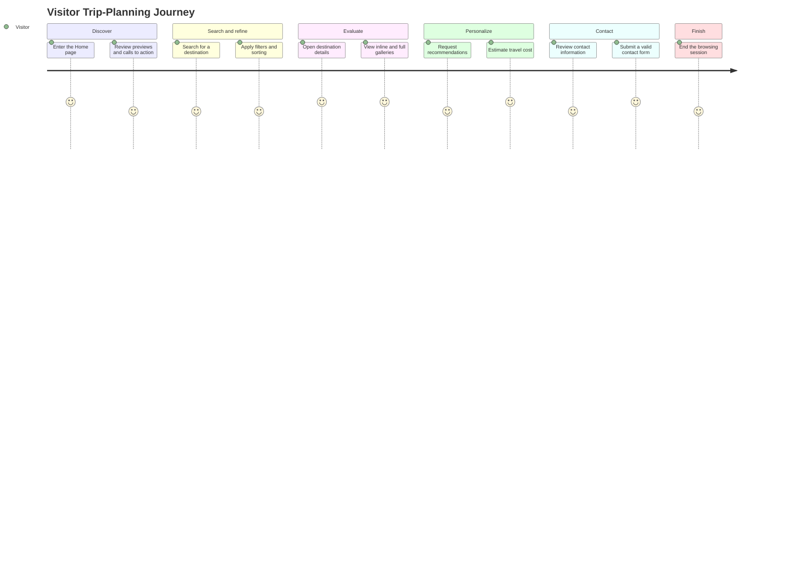
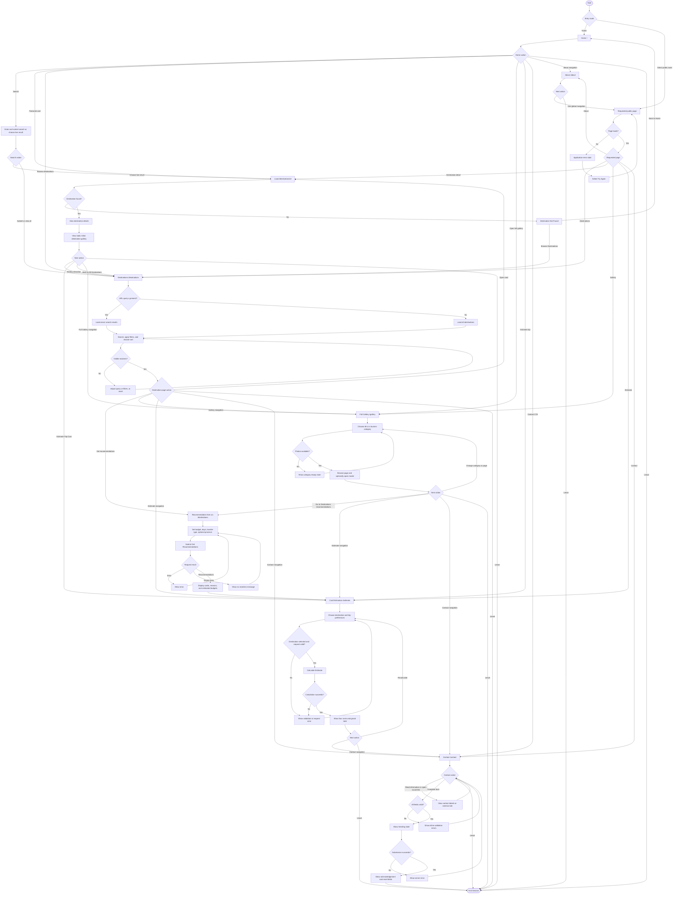
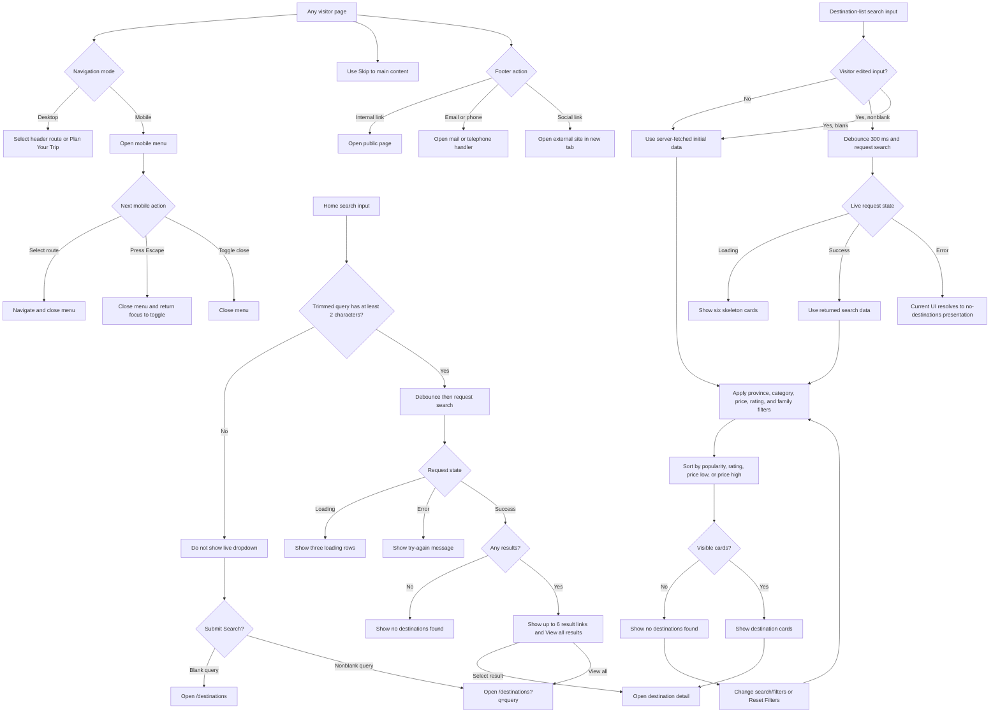
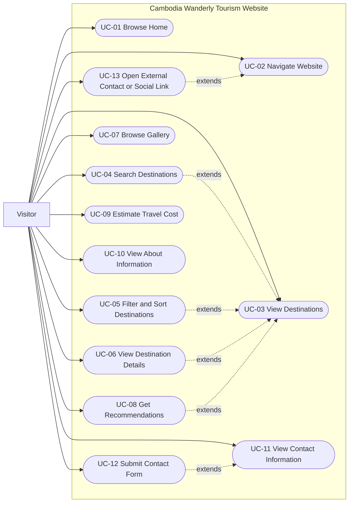

# Tourism Website — User Journey, User Flow, and Use Cases

**Project:** CAMDEST
**Documentation basis:** Current implemented source code and JSON data  
**Application type:** Next.js App Router tourism website  
**Primary actor:** Visitor  
**Documentation date:** 2026-08-02

> This document describes only behavior present in the current implementation. It does not treat planned integrations, backend-only operations, placeholders, or static preview values as completed visitor features.

## Implementation Scope and Traceability

### Analysis objective

Establish the implemented system boundary before documenting journeys and use cases, so every route, interaction, state, and decision is traceable to current application code.

### Analysis summary

The application has seven visitor-facing page routes and six API route groups. Visitors do not authenticate and there is no Admin, Login, Dashboard, booking, payment, or account workflow.

| Area | Current implementation |
|---|---|
| Visitor pages | `/`, `/destinations`, `/destinations/[id]`, `/gallery`, `/estimate`, `/about`, `/contact` |
| Global navigation | Home, Destinations, Gallery, Estimate, About, Contact; desktop and mobile variants; “Plan Your Trip” links to `/estimate` |
| Destination data | 16 destinations in 9 provinces: 7 Cultural & Heritage, 6 Eco Tourism, and 3 Dark Tourism |
| Search | Home instant search and destination-list live search; matches destination name, province, category, or activity through `/api/search` |
| Filters | Province, category, minimum/maximum price, minimum rating, family-friendly only, four sort modes, and reset |
| Gallery | 37 data-provided images; All, Eco Tourism, Cultural & Heritage, and Dark Tourism filters; 18 images per page; modal controls |
| Recommendations | Budget, travel days, traveler type, and optional province; scored results with an implemented top-rated fallback |
| Estimator | Destination, transport, accommodation, food budget, travel days, travelers, and optional activities; four-part cost breakdown and total |
| Contact | Validated Name, Email, Phone, Subject, and Message form with submitting, success, and error states |
| Destination API CRUD | GET, POST, PUT, and DELETE are implemented, but no visitor page exposes create, update, or delete controls |
| Recovery states | Route loading skeletons, inline loading/empty/error states, destination-not-found recovery, and a retryable application error boundary |

### Backend boundary relevant to visitor documentation

| Route handler | Implemented behavior | Visitor-facing use |
|---|---|---|
| `GET /api/destinations` | Reads all destinations | Home previews, destination list, gallery, and estimator |
| `POST /api/destinations` | Creates a validated destination in the JSON data file | None; no visitor UI calls it |
| `GET /api/destinations/[id]` | Reads one destination or returns not found | Destination detail page |
| `PUT /api/destinations/[id]` | Partially updates a validated destination | None; no visitor UI calls it |
| `DELETE /api/destinations/[id]` | Deletes a destination | None; no visitor UI calls it |
| `GET /api/search` | Searches by query, province, category, and/or activity | Home and destination-list search |
| `GET /api/recommendations` | Scores rule matches and falls back to top-rated destinations | Home preview and recommendation form |
| `POST /api/estimate` | Validates selections and calculates a breakdown | Cost estimator |
| `POST /api/contact` | Validates the message, logs name/email/subject, and returns success | Contact form; it does not persist data or send email |

**System-boundary decision:** Destination creation, update, and deletion are verified implementation details, but they are omitted from the Visitor use case diagram and descriptions because they are backend-only and there is no second implemented actor.

---

# 1. User Journey

## 1.1 Objective

Describe how a Visitor moves from discovery to destination research, visual exploration, personalized recommendations, budget estimation, and contact, including entry points, goals, decisions, feature use, and outcomes.

## 1.2 Analysis summary

The requested journey is supported, but not enforced as a wizard. Global navigation allows the Visitor to enter, skip, revisit, or leave any stage. In particular:

- The destination detail page contains a static inline destination gallery; the interactive full gallery is the separate `/gallery` route.
- The recommendation form is a section at the bottom of `/destinations`, not a separate page.
- After the full gallery, the Visitor uses global navigation to return to Destinations and use recommendations.
- Recommendation cards display a destination, reasons, and estimated budget but are not links.
- The detail-page estimator link opens `/estimate` without preselecting the current destination.

## 1.3 Documentation

### Journey profile

| Item | Description |
|---|---|
| Actor | Visitor |
| Primary entry point | Home page (`/`) |
| Alternate entry points | Any public page route or a destination detail URL |
| Primary goal | Discover a suitable Cambodia destination and obtain enough visual, recommendation, cost, and contact information to plan a trip |
| Preconditions | The application and its local JSON-backed route handlers are available; no sign-in is required |
| Expected final outcomes | Destination information reviewed; recommendations viewed; cost estimate calculated; contact form submitted or contact channels viewed; or session ended without submission |

### End-to-end journey

| Stage | Entry point and goal | Visitor actions and navigation path | Decision points and system response | Stage outcome |
|---|---|---|---|---|
| 1. Enter and discover | Enter `/`; understand what the site offers | Review hero content, tourism categories, six popular destination cards, recommendation preview, gallery preview, estimator preview, testimonials, and calls to action | Search now, open a featured destination, browse all destinations, open gallery, estimate directly, contact the company, view About, or leave | Visitor chooses a research path |
| 2. Search Destination | Home search or `/destinations`; locate relevant places | Type a destination, province, category, or activity. On Home, a query of at least two characters opens debounced live results; submit/search and “View all results” navigate to `/destinations?q=...` | Live request may load, return up to six visible suggestions plus “View all results,” return no matches, or fail. Submitting a blank Home query opens the full destination list | Search results or full destination list is displayed |
| 3. Apply Filters | `/destinations`; narrow and order results | Edit the live query; choose province/category; adjust price and rating ranges; toggle family-friendly; choose popularity, rating, low-price, or high-price sort; reset if needed | If matches remain, cards are shown. If none remain, the page asks the Visitor to adjust filters or search. Live search shows a skeleton while pending | A manageable destination set is available |
| 4. View Destination | Select a search result or destination card; evaluate one place | Review image, category, name, province, rating, description, activities, entrance fee, hours, family suitability, popularity, reviews, nearby attractions, map coordinates, and typical weather placeholder | Valid ID shows details. Invalid/removed ID shows “Destination Not Found” with Home and Destinations recovery links. Nearby attraction links start another destination query | Visitor understands the destination or returns to continue browsing |
| 5. View Gallery | Detail inline gallery or global `/gallery`; inspect imagery | View every image attached to the destination on the detail page. In the full gallery, filter by category, change pages, open a photo, and use previous/next/close controls | A category may show photos or an empty state. Pagination appears only for multiple pages. Modal navigation wraps within the current page; it closes by button, overlay click, or Escape and supports arrow keys | Visitor completes visual comparison and returns to another feature through navigation |
| 6. Get Recommendations | Return/navigate to `/destinations`; request personalized suggestions | Enter budget (USD), travel days, traveler type, and optional province; submit “Get Recommendations” | The form shows loading, results, an empty-result message if an empty array is returned, or an error. Matching rules are scored; when none score, the repository returns top-rated fallback destinations | Up to eight recommendation cards display reasons and estimated budgets |
| 7. Estimate Travel Cost | Use a Home/detail/navigation estimator link; calculate a budget | On `/estimate`, select destination, transport, accommodation, food budget, days, travelers, and optional activity toggles; calculate | Missing destination, invalid server input, missing destination data, or request failure produces an error. A successful request returns accommodation, transport, food, activity, and grand total values. Visitor may alter inputs and recalculate | An indicative trip-cost breakdown is displayed |
| 8. Contact Company | Use Home CTA or global navigation; seek assistance | On `/contact`, read contact information and office map placeholder, optionally open social links, then enter all five required form fields and submit | Invalid fields show exact inline validation messages. A valid submission shows “Sending...,” then success and resets fields, or displays a server error for retry | Visitor receives an on-screen acknowledgement; no email or database persistence occurs |
| 9. End Session | Any page; finish research | Leave the site, close the browser/tab, or stop interacting | The application has no explicit logout or “End Session” control because there is no account/session feature | Journey ends with viewed information, an estimate, a contact acknowledgement, or no conversion |

### Alternate and cross-cutting journeys

| Situation | Implemented path |
|---|---|
| Direct detail entry | Open `/destinations/[id]` → valid details or destination-not-found recovery |
| Direct planning entry | Open `/estimate` → use defaults or change selections → calculate/recalculate |
| Direct contact entry | Open `/contact` → view information/social links and/or submit form |
| About-only visit | Open `/about` → read mission, vision, tourism categories, displayed statistics, team, and timeline → navigate elsewhere or leave |
| Mobile navigation | Open menu → select route, toggle it closed, or press Escape; route selection closes the menu and Escape returns focus to the toggle |
| Page-load failure | Application error boundary → “Try Again” → retry the failed render |
| Accessibility shortcut | Focus “Skip to main content” → jump past global navigation to `#main-content` |
| External contact/social path | Use footer email/phone links or footer/contact-page social links → browser opens the associated external handler/site |

## 1.4 Mermaid journey diagram

## 1.5 Verification against current implementation

- Home stages trace to `src/app/page.tsx` and its seven rendered sections.
- Search and filter stages trace to `InstantSearch`, `DestinationsExplorer`, `FilterSidebar`, `useDestinationSearch`, and `applyFilters`.
- Detail decisions trace to `src/app/destinations/[id]/page.tsx` and `not-found.tsx`.
- Gallery controls trace to `GalleryClient`, `GalleryGrid`, `GalleryModal`, `CategoryTabs`, and `Pagination`.
- Recommendation, estimator, and contact states trace to their forms and corresponding route handlers.
- “End Session” is documented only as a flow terminator, not as an invented application feature.

---

# 2. User Flow

## 2.1 Objective

Model the complete Visitor flow in valid Mermaid flowchart syntax, including the required Home → Search → Filters → Destination → Gallery → Recommendations → Estimate → Contact sequence and the implemented alternatives, errors, empty states, recovery paths, and navigation exits.

## 2.2 Analysis summary

The application is non-linear. The diagrams therefore show a representative end-to-end route plus detailed subflows for controls whose decisions cannot be legibly represented in one chain. All page changes shown below are supported by links or global navigation.

## 2.3 Documentation

### Flow conventions

| Shape | Meaning |
|---|---|
| Rounded terminal | Start or end of the Visitor flow |
| Rectangle | Page, state, or Visitor action |
| Diamond | Implemented decision or result branch |
| Labeled arrow | Trigger, selection, result, or recovery action |

### Navigation map

| Source | Implemented destinations/actions |
|---|---|
| Global header | Home, Destinations, Gallery, Estimate, About, Contact, and Plan Your Trip |
| Home | Search, destination details, all destinations, gallery, estimate, contact |
| Destinations | Live search, filters/sort/reset, destination details, recommendations |
| Destination detail | Nearby-attraction search, estimate, all destinations; full Gallery/other pages remain available globally |
| Gallery | Category filter, pagination, modal; all public routes remain available globally |
| Contact/footer | Contact information, external social links; footer also has clickable email and phone links |

## 2.4 Mermaid diagrams

### A. Complete end-to-end Visitor flow

### B. Search, filtering, and navigation decision detail

### C. Gallery, recommendation, estimator, and contact state detail

```mermaid
flowchart TD
    subgraph GalleryFlow["Full Gallery"]
      GStart["Load all 37 data-provided images"] --> GCategory["Select All, Eco, Cultural and Heritage, or Dark"]
      GCategory --> GReset["Reset gallery page to 1"]
      GReset --> GAny{"Filtered images available?"}
      GAny -->|No| GEmpty["Show no photos in this category"]
      GEmpty --> GCategory
      GAny -->|Yes| GPage["Show up to 18 images"]
      GPage --> GPages{"More than one page?"}
      GPages -->|Yes| GPaging["Use previous, numbered, or next page controls"]
      GPaging --> GPage
      GPages -->|No| GPhoto
      GPage --> GPhoto{"Open a photo?"}
      GPhoto -->|No| GCategory
      GPhoto -->|Yes| GModal["Open modal, lock body scroll, focus Close"]
      GModal --> GModalAction{"Modal action"}
      GModalAction -->|Previous or Arrow Left| GPrev["Show previous image with wraparound"]
      GModalAction -->|Next or Arrow Right| GNext["Show next image with wraparound"]
      GPrev --> GModal
      GNext --> GModal
      GModalAction -->|Tab or Shift Tab| GTrap["Keep focus inside modal"]
      GTrap --> GModal
      GModalAction -->|Close button, overlay, or Escape| GClose["Close and restore trigger focus"]
    end

    subgraph RecommendationFlow["Recommendations"]
      RInput["Enter implemented criteria"] --> RSubmit["Submit"]
      RSubmit --> RLoading["Finding matches"]
      RLoading --> ROutcome{"API outcome"}
      ROutcome -->|Error| RError["Show error and allow retry"]
      RError --> RInput
      ROutcome -->|Empty| REmpty["Show no matches and allow adjustment"]
      REmpty --> RInput
      ROutcome -->|Matched or fallback data| RCards["Show up to 8 display-only cards"]
    end

    subgraph EstimateFlow["Cost Estimator"]
      EInput["Choose destination, transport, stay, food, days, travelers, activities"] --> EDestination{"Destination ID present?"}
      EDestination -->|No| ESelectError["Ask Visitor to select a destination"]
      ESelectError --> EInput
      EDestination -->|Yes| ESubmit["Calculate and show Calculating state"]
      ESubmit --> EOutcome{"Validated API outcome"}
      EOutcome -->|Invalid, missing destination, or failure| EError["Show error"]
      EError --> EInput
      EOutcome -->|Success| EBreakdown["Show accommodation, transportation, food, activities, and total"]
      EBreakdown --> EInput
    end

    subgraph ContactFlow["Contact Form"]
      CInput["Enter Name, Email, Phone, Subject, Message"] --> CValid{"Client validation passes?"}
      CValid -->|No| CErrors["Show field-specific errors"]
      CErrors --> CInput
      CValid -->|Yes| CSubmit["Submit and show Sending state"]
      CSubmit --> COutcome{"Server outcome"}
      COutcome -->|Error| CServerError["Show error and preserve retry path"]
      CServerError --> CInput
      COutcome -->|Success| CSuccess["Show acknowledgement and reset all fields"]
    end
```

## 2.5 Verification against current implementation

| Flow branch | Implementation evidence |
|---|---|
| Home query threshold and live states | `InstantSearch` uses a two-character threshold, debounced hook, six-result limit, loading/no-result/error branches, and submit fallback |
| Destination live search | `DestinationsExplorer` uses a 300 ms debounce and applies client filters after server search |
| Filters and sorting | `FilterSidebar`, `FilterContext`, and `applyFilters` implement every shown option and reset |
| Detail/not-found | Dynamic detail page calls `notFound()` when lookup fails; recovery links are implemented |
| Full gallery | `IMAGES_PER_PAGE` is 18; category change resets page; modal navigation wraps within the current page |
| Recommendation branches | Form implements loading, error, empty, and result branches; repository implements top-rated fallback |
| Estimator branches | Form checks destination presence; API performs Zod validation and destination lookup before calculation |
| Contact branches | React Hook Form/Zod supplies field errors; submit state supports sending, success/reset, and server error |
| End Session | Used only as a terminal node; it does not imply logout or stored session state |

---

# 3. UML Use Case Diagram

## 3.1 Objective

Define the Visitor’s functional interactions with the implemented Tourism Website inside a clear system boundary, without adding fictional actors or backend-only use cases.

## 3.2 Analysis summary

Only one actor is implemented: **Visitor**. Public pages do not require authentication. API CRUD mutation functions are not connected to a visitor interface, so “Create Destination,” “Update Destination,” and “Delete Destination” are intentionally absent. Error, loading, and empty states are modeled as alternate flows rather than separate user-goal use cases.

## 3.3 Documentation

### Use case catalog

| ID | Use case | Primary route/context |
|---|---|---|
| UC-01 | Browse Home | `/` |
| UC-02 | Navigate Website | Global header, mobile menu, skip link, and footer |
| UC-03 | View Destinations | `/destinations` |
| UC-04 | Search Destinations | Home and `/destinations` |
| UC-05 | Filter and Sort Destinations | `/destinations` |
| UC-06 | View Destination Details | `/destinations/[id]` |
| UC-07 | Browse Gallery | `/gallery` and inline detail gallery |
| UC-08 | Get Recommendations | Recommendation preview and form on `/destinations` |
| UC-09 | Estimate Travel Cost | `/estimate` |
| UC-10 | View About Information | `/about` |
| UC-11 | View Contact Information | `/contact` and footer |
| UC-12 | Submit Contact Form | `/contact` |
| UC-13 | Open External Contact or Social Link | Footer and `/contact` social links |

## 3.4 Mermaid UML-style use case diagram

Mermaid does not provide a dedicated UML use-case diagram type. The following valid Mermaid flowchart uses a system boundary and rounded use-case nodes while preserving UML actor/use-case relationships.

## 3.5 Verification against current implementation

- The diagram has exactly one actor and includes no authentication, Admin, Dashboard, booking, payment, or destination-management use case.
- Every use case maps to at least one rendered page or global component.
- Search and filtering extend destination browsing because they are optional refinements on `/destinations`.
- Recommendations extend destination browsing because the form is rendered on that page.
- Contact submission extends viewing the Contact page; a Visitor may read information without submitting.
- API-internal reads, scoring, calculations, validation, file writes, and logging are implementation mechanisms, not additional actors or Visitor use cases.

---

# 4. Use Case Descriptions

## 4.1 Objective

Specify the goal, preconditions, main flow, alternative flow, and postconditions for every Visitor use case shown in the diagram.

## 4.2 Analysis summary

The descriptions below use route and control names exactly as implemented. They distinguish displayed previews from interactive tools, static placeholders from live integrations, and on-screen acknowledgements from persisted or transmitted contact messages.

## 4.3 Documentation

### UC-01 — Browse Home

| Field | Description |
|---|---|
| Use Case Name | Browse Home |
| Actor | Visitor |
| Goal | Understand the website’s tourism scope and choose a destination-research or planning action. |
| Preconditions | Application is available; no authentication is required. |
| Main Flow | 1. Visitor opens `/`. 2. System displays the hero, instant search, and Destinations/Estimate calls to action. 3. System displays the six highest-popularity destination cards. 4. System displays up to three default recommendation preview cards, a preview using the first eight destinations’ lead images, a static estimator example, three testimonials, and final Destinations/Contact calls to action. 5. Visitor chooses a card, search result, CTA, or global navigation link. |
| Alternative Flow | A1. If the recommendation preview returns no results, that section renders nothing. A2. If page data loading fails, the error boundary displays “Try Again.” A3. Visitor may leave without selecting an action. |
| Postconditions | Home content has been viewed; the Visitor remains on Home, navigates to another implemented route, or ends the session. |

### UC-02 — Navigate Website

| Field | Description |
|---|---|
| Use Case Name | Navigate Website |
| Actor | Visitor |
| Goal | Move among public pages and page content. |
| Preconditions | Any visitor page is rendered. |
| Main Flow | 1. Visitor uses the desktop header to select Home, Destinations, Gallery, Estimate, About, Contact, or Plan Your Trip. 2. System highlights the active main route. 3. Visitor may use footer internal links to the same six public pages. 4. Keyboard Visitor may use “Skip to main content” to focus the main page region. |
| Alternative Flow | A1. On mobile, Visitor toggles the menu and chooses a route; route change closes the menu. A2. Visitor closes the mobile menu with its toggle. A3. Visitor presses Escape; the menu closes and focus returns to the toggle. A4. A failed page render exposes “Try Again,” which invokes the error-boundary reset. |
| Postconditions | Requested public page or main-content region is active, or the failed render has been retried. |

### UC-03 — View Destinations

| Field | Description |
|---|---|
| Use Case Name | View Destinations |
| Actor | Visitor |
| Goal | Browse available Cambodia destinations and choose one for detailed review. |
| Preconditions | `/destinations` is reachable; destination API data is available. |
| Main Flow | 1. Visitor opens `/destinations`. 2. System fetches all destinations, or server-searches when a `q` URL parameter exists. 3. System applies default client filters and popularity sorting. 4. System shows destination cards with lead image, category, name, rating, province, description, price, and “View Details.” 5. Visitor opens a card or continues with search, filters, or recommendations. |
| Alternative Flow | A1. During route loading, a skeleton page is shown. A2. If no destination survives the current search/filter combination, “No destinations found” is shown with adjustment guidance. A3. Visitor may reset filters or navigate away without opening a card. |
| Postconditions | A destination list or empty state is displayed; the Visitor may open details or another feature. |

### UC-04 — Search Destinations

| Field | Description |
|---|---|
| Use Case Name | Search Destinations |
| Actor | Visitor |
| Goal | Find destinations by name, province, category text, or activity. |
| Preconditions | Home or Destinations page is rendered; `/api/search` is reachable for live search. |
| Main Flow | 1. Visitor enters text in the Home search. 2. At two or more trimmed characters, the system performs a debounced search and shows a dropdown. 3. System displays up to six result links plus “View all results.” 4. Visitor selects a result to open its detail page, or selects “View all results”/submits the form to open `/destinations?q=...`. 5. On `/destinations`, editing a nonblank query triggers a 300 ms debounced live search; client filters and sorting are then applied to returned results. |
| Alternative Flow | A1. Fewer than two Home characters produce no live dropdown, but form submission still navigates using the nonblank query. A2. Blank Home submission opens `/destinations` without a query. A3. Home live search shows loading rows, a no-results message, or an explicit error message. A4. Destination-list live search shows skeleton cards while loading. A5. Empty destination-list results show the general no-destinations state. A6. Clearing an edited destination-list query returns to the server-fetched initial dataset for that page load. A7. A destination-list live-search error currently falls through to its no-destinations presentation rather than a distinct error alert. |
| Postconditions | Matching cards, a no-results state, or a destination detail page is displayed. |

### UC-05 — Filter and Sort Destinations

| Field | Description |
|---|---|
| Use Case Name | Filter and Sort Destinations |
| Actor | Visitor |
| Goal | Refine and order the current destination dataset. |
| Preconditions | `/destinations` and its `FilterProvider` are rendered. |
| Main Flow | 1. Visitor optionally selects one province. 2. Visitor selects All Categories, Eco Tourism, Cultural & Heritage, or Dark Tourism. 3. Visitor adjusts minimum and maximum price between USD 0 and 100; controls prevent minimum from exceeding maximum. 4. Visitor selects a minimum rating from 0 to 5 in 0.5 increments. 5. Visitor optionally enables “Family Friendly Only.” 6. Visitor sorts by Most Popular, Highest Rated, Price Low to High, or Price High to Low. 7. System immediately displays the filtered and sorted cards. |
| Alternative Flow | A1. If no cards match, system shows the no-destinations state. A2. Visitor adjusts one or more controls to recover matches. A3. Visitor selects “Reset Filters,” restoring all provinces/categories, USD 0–100, rating 0, family-friendly off, and popularity sort. |
| Postconditions | Current search/base data is displayed using the chosen filter and sort state. |

### UC-06 — View Destination Details

| Field | Description |
|---|---|
| Use Case Name | View Destination Details |
| Actor | Visitor |
| Goal | Evaluate a specific destination and choose a follow-up planning action. |
| Preconditions | Visitor has or directly enters a destination ID. |
| Main Flow | 1. System fetches `/api/destinations/[id]`. 2. System displays lead image, category, name, province, rating, description, and activity tags. 3. System displays every destination-provided image in a static inline grid. 4. System displays coordinates in a map placeholder and a fixed 28°C “Typical weather” placeholder. 5. System displays reviews or the no-reviews message, and nearby attractions when present. 6. System displays entrance fee, opening hours, family-friendly status, and popularity. 7. Visitor may open a nearby-attraction query, select “Estimate Trip Cost,” or return to all destinations. |
| Alternative Flow | A1. Invalid or removed ID displays “Destination Not Found.” A2. From not-found, Visitor chooses Browse Destinations or Back to Home. A3. Empty activities or nearby-attraction arrays render no list; empty reviews render the implemented no-reviews message. A4. Visitor uses global navigation to open the separate full Gallery or another page. |
| Postconditions | Destination information is reviewed; Visitor stays, starts another search, opens the estimator, returns to browsing, or navigates elsewhere. |

### UC-07 — Browse Gallery

| Field | Description |
|---|---|
| Use Case Name | Browse Gallery |
| Actor | Visitor |
| Goal | View destination images by tourism category and inspect individual images. |
| Preconditions | For the full experience, `/gallery` is rendered with destination data. |
| Main Flow | 1. System flattens all destination image arrays into 37 gallery entries. 2. Visitor selects All, Eco Tourism, Cultural & Heritage, or Dark Tourism; category change resets page to 1. 3. System displays up to 18 images per page and pagination only when more than one page exists. 4. Visitor changes page using previous, numbered, or next controls. 5. Visitor opens an image; modal shows image, destination, province, and category. 6. Visitor moves previous/next using buttons or Left/Right Arrow; navigation wraps within the currently paged images. 7. Visitor closes using the Close button, overlay, or Escape. |
| Alternative Flow | A1. An empty category shows “No photos in this category yet.” A2. When only one page exists, pagination is omitted. A3. Tab and Shift+Tab are trapped inside the modal. A4. Closing restores focus to the image trigger and restores body scrolling. A5. On a destination detail page, the inline gallery displays images only and has no modal controls. |
| Postconditions | Gallery remains at the selected category/page after modal close, or Visitor navigates elsewhere. |

### UC-08 — Get Recommendations

| Field | Description |
|---|---|
| Use Case Name | Get Recommendations |
| Actor | Visitor |
| Goal | Receive destination suggestions based on implemented trip criteria. |
| Preconditions | Recommendation preview can load, or `/destinations` is rendered with the recommendation form. |
| Main Flow | 1. Visitor reviews or changes Budget (USD), Travel Days, Traveler Type, and optional Province. 2. Traveler Type is one of Family, Couple, Solo, Adventure, Beach, or Culture. 3. Visitor submits “Get Recommendations.” 4. System displays “Finding matches...” while requesting `/api/recommendations`. 5. Repository filters optional province/category criteria, scores tag and budget-tier matches with rating/popularity, and returns up to eight items. 6. System displays cards with image, category, destination, province, up to two reasons, and estimated budget. |
| Alternative Flow | A1. If no scored rules remain, repository falls back to the six top-rated destinations overall. A2. If the API nevertheless returns an empty array, form displays “No matches found.” A3. Request failure displays an error; Visitor may adjust and retry. A4. Home preview independently requests Culture with USD 40 and displays up to three cards; no-result preview is omitted. A5. Recommendation cards are display-only and do not navigate to details. |
| Postconditions | Suggestions are displayed or an error/empty state is visible; criteria remain available for another request. |

### UC-09 — Estimate Travel Cost

| Field | Description |
|---|---|
| Use Case Name | Estimate Travel Cost |
| Actor | Visitor |
| Goal | Calculate an indicative trip-cost breakdown for selected preferences. |
| Preconditions | `/estimate` is rendered; destination data is available. |
| Main Flow | 1. System defaults to the first destination, Private Car, Standard accommodation, Medium food budget, 3 days, 2 travelers, and no optional activities. 2. Visitor changes destination if desired. 3. Visitor chooses Bus, Private Car, Train, or Flight. 4. Visitor chooses Budget, Standard, or Luxury accommodation and Low, Medium, or High food budget. 5. Visitor enters 1–60 travel days and 1–50 travelers. 6. Visitor toggles any of the ten implemented activity options. 7. Visitor selects “Calculate Estimate”; system shows “Calculating...” and posts the request. 8. System displays accommodation, transportation, food, activities, and grand total for the returned destination. |
| Alternative Flow | A1. If no destination is available/selected, form requests a destination selection. A2. API rejects invalid enum values, out-of-range numbers, or an unknown destination and the form displays the returned error. A3. Request failure displays an error and clears any previous result. A4. Visitor changes inputs and recalculates. A5. Opening from a detail page does not preselect that destination. |
| Postconditions | A cost breakdown is shown, or an actionable error remains visible; no booking or payment is created. |

### UC-10 — View About Information

| Field | Description |
|---|---|
| Use Case Name | View About Information |
| Actor | Visitor |
| Goal | Learn the website’s stated mission, tourism focus, team, and history. |
| Preconditions | `/about` is reachable. |
| Main Flow | 1. Visitor opens About. 2. System displays mission and vision. 3. System displays the three tourism-category descriptions. 4. System displays static statistics, team members, and timeline milestones. 5. Visitor reads the content and uses global navigation or footer links. |
| Alternative Flow | A1. Visitor leaves without navigating further. A2. Static displayed statistics are informational page content; they are not dynamically calculated from the current dataset. |
| Postconditions | About information has been viewed; application data is unchanged. |

### UC-11 — View Contact Information

| Field | Description |
|---|---|
| Use Case Name | View Contact Information |
| Actor | Visitor |
| Goal | Find displayed company contact and office information without necessarily sending a form. |
| Preconditions | `/contact` or the global footer is rendered. |
| Main Flow | 1. Visitor opens Contact. 2. System displays address, email, phone, office hours, and social links. 3. System displays office coordinates using the map placeholder. 4. Visitor may proceed to the contact form, open a social link, or navigate elsewhere. 5. Footer separately displays its implemented address, clickable email, clickable phone, and social links. |
| Alternative Flow | A1. Contact-page email and phone values are displayed as text, while footer email and phone are actionable `mailto:` and `tel:` links. A2. The office map is a coordinate placeholder and not an interactive map integration. |
| Postconditions | Contact information has been viewed; no message is submitted unless UC-12 is performed. |

### UC-12 — Submit Contact Form

| Field | Description |
|---|---|
| Use Case Name | Submit Contact Form |
| Actor | Visitor |
| Goal | Send a validated inquiry and receive an on-screen acknowledgement. |
| Preconditions | `/contact` is rendered; all fields are available. |
| Main Flow | 1. Visitor enters Name, Email, Phone, Subject, and Message; all are required. 2. Client validates: name 2–100 trimmed characters; valid email; phone 6–20 characters using digits, spaces, `+`, `-`, and parentheses; subject 3–150 trimmed characters; message 10–2000 trimmed characters. 3. Visitor selects “Send Message.” 4. System disables submission and shows “Sending...” while posting to `/api/contact`. 5. Server repeats schema validation, logs name/email/subject metadata, and returns a success message. 6. Form displays the acknowledgement and resets all fields. |
| Alternative Flow | A1. Client validation failure displays field-specific accessible errors and does not submit. A2. Server validation or request failure displays a form-level error; Visitor may correct/retry. A3. Visitor leaves without submitting. |
| Postconditions | On success, fields are cleared and an acknowledgement is displayed. The current implementation does not send email or persist the message in a database. |

### UC-13 — Open External Contact or Social Link

| Field | Description |
|---|---|
| Use Case Name | Open External Contact or Social Link |
| Actor | Visitor |
| Goal | Continue contact or social engagement outside the website. |
| Preconditions | Footer or Contact-page social controls are rendered; the browser supports the target handler/site. |
| Main Flow | 1. Visitor selects Instagram, Facebook, Twitter, or YouTube in the footer or Contact information card. 2. Browser opens the external URL in a new tab with `noopener noreferrer`. 3. Alternatively, Visitor selects footer email or phone. 4. Browser invokes the configured mail or telephone handler. |
| Alternative Flow | A1. Browser/device may have no configured email or telephone handler. A2. External site availability and behavior are outside the Tourism Website system boundary. A3. Visitor cancels and remains on the current page. |
| Postconditions | External site or handler is requested; Tourism Website data remains unchanged. |

## 4.4 Mermaid diagram reference

The authoritative relationship diagram for these descriptions is the Mermaid UML-style diagram in Section 3.4. IDs UC-01 through UC-13 match one-to-one with the descriptions above.

## 4.5 Verification against current implementation

- All thirteen descriptions contain the required name, actor, goal, preconditions, main flow, alternative flow, and postconditions.
- Form limits and option labels match `validation.ts`, `estimate-options.ts`, and the rendered form components.
- Search debounce and result-limit details match current hooks/components.
- Recommendation fallback and estimator formulas are described as system behavior without exposing them as separate Visitor use cases.
- Placeholder map/weather behavior and simulated contact submission are explicitly constrained to avoid implying live integrations.
- No destination mutation is assigned to Visitor because no rendered component calls create, update, or delete services.

---

# 5. Final Coverage and Verification

## 5.1 Features documented

- Global desktop/mobile navigation, active state, footer navigation, skip link, and recovery action
- Home hero, instant search, featured destinations, recommendation preview, gallery preview, estimator preview, testimonials, and CTAs
- Destination listing, URL search, live search, all filters, all sort modes, reset, loading, no-result, and card selection
- Destination details, activities, inline image gallery, coordinate/weather placeholders, reviews, nearby searches, estimator link, and not-found recovery
- Full gallery categories, pagination, image modal, wraparound navigation, overlay/button/keyboard close, focus trap, and focus restoration
- Recommendation criteria, loading, scored/fallback results, empty/error states, and display-only result cards
- Estimator selections, optional activities, validation, calculation state, errors, result breakdown, and recalculation
- About information sections
- Contact information, social/contact links, exact form validation, submitting, success/reset, and error behavior
- Read-only visitor use of destination APIs plus the explicit exclusion of backend-only mutation operations

## 5.2 Pages covered

| Page | Route | Covered sections |
|---|---|---|
| Home | `/` | Journey, flows, UC-01, UC-04 |
| Destinations | `/destinations` | Journey, flows, UC-03, UC-04, UC-05, UC-08 |
| Destination Detail | `/destinations/[id]` | Journey, flows, UC-06, UC-07, UC-09 link path |
| Gallery | `/gallery` | Journey, flows, UC-07 |
| Cost Estimation | `/estimate` | Journey, flows, UC-09 |
| About | `/about` | Journey, flow, UC-10 |
| Contact | `/contact` | Journey, flows, UC-11, UC-12, UC-13 |

## 5.3 User interactions covered

- Clicking/tapping all internal navigation categories and CTAs
- Opening, closing, and keyboard-closing the mobile menu
- Entering/submitting Home and destination-list searches
- Selecting live search results and “View all results”
- Applying, combining, sorting, adjusting, and resetting destination filters
- Opening destination cards and recovering from invalid detail IDs
- Following nearby-attraction query links
- Filtering and paginating the gallery
- Opening, traversing, keyboard-operating, and closing the gallery modal
- Entering recommendation criteria, submitting, adjusting, and retrying
- Selecting all estimator dimensions, toggling activities, calculating, and recalculating
- Reading About and Contact content
- Entering, validating, submitting, resetting, correcting, and retrying the contact form
- Opening external social, email, and telephone targets
- Skipping to main content, retrying a failed page, navigating away, and ending the visit

## 5.4 Missing documentation

**None for the implemented Visitor-facing scope.** The following are intentionally not documented as Visitor use cases because they are not implemented as Visitor interactions:

- Admin, Login, Authentication, Dashboard, user accounts, logout, booking, payment, or saved itineraries
- Visitor creation, update, or deletion of destinations
- Live maps or live weather
- Contact-message email delivery or database persistence
- Clicking recommendation cards to open details
- Opening destination-detail inline images in the full-gallery modal
- A dedicated application “End Session” control

## 5.5 Final implementation confirmation

This documentation matches the current application implementation inspected on 2026-08-02. It uses current source and data as authoritative, including 16 destinations and 37 gallery images. No planned features are represented as implemented, no fictional actors/pages/routes are introduced, and backend-only destination mutations are not assigned to the Visitor.
